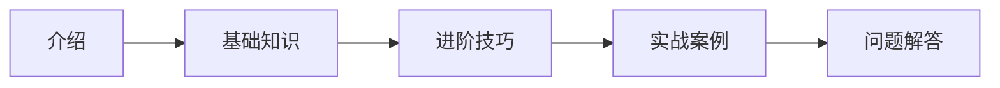

# 专栏1介绍

## 欢迎来到专栏1

这是专栏1的介绍文章，在这个专栏中，我们将详细讨论一些有趣的主题。

## 专栏内容概述

该专栏将包含以下内容：

1. 基础知识介绍
2. 进阶技巧分享
3. 实战案例解析
4. 常见问题解答

## 如何阅读本专栏

建议按照文章顺序阅读，每篇文章都是基于前面内容的基础上进行的扩展。



## 示例代码

```js
function example() {
  console.log("这是一个示例函数");
  return "Hello World!";
}
```

希望这个专栏对你有所帮助！ 