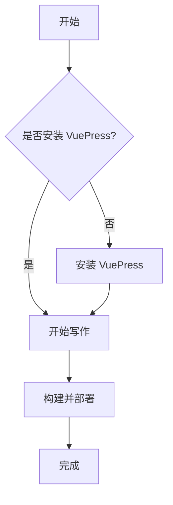

# VuePress 博客介绍

## 什么是 VuePress？

VuePress 是一个由 Vue 驱动的静态网站生成器，最初是为了支持 Vue 及其子项目的文档需求而创建的。它以 Markdown 为中心的项目结构，以最少的配置帮助你专注于写作。

## 为什么选择 VuePress？

VuePress 具有以下优势：

1. **简洁至上**：以 Markdown 为中心的项目结构，帮助你专注于写作
2. **Vue 驱动**：享受 Vue + webpack 的开发体验，在 Markdown 中使用 Vue 组件
3. **高性能**：VuePress 为每个页面预渲染静态 HTML，同时在页面加载后作为 SPA 运行
4. **主题系统**：提供了默认主题，也可以选择社区主题或创建自己的主题
5. **插件系统**：灵活的插件 API，允许插件提供各种实用功能

## 特色功能展示

### 代码块高亮

```js
// 这是一个JavaScript代码示例
export default {
  data() {
    return {
      message: 'Hello VuePress!'
    }
  },
  methods: {
    hello() {
      console.log(this.message)
    }
  }
}
```

### 数学公式支持

你可以在 Markdown 中使用 TeX 语法编写数学公式：

$$
\frac{\partial f}{\partial x} = 2\sqrt{a}x
$$

### Mermaid 流程图



## 开始使用

要开始使用 VuePress 创建你的博客，你需要：

1. 安装 VuePress
2. 创建基本项目结构
3. 配置你的网站
4. 开始写作
5. 构建并部署

详细的步骤可以参考 [VuePress 官方文档](https://vuepress.vuejs.org/)。

::: tip
本博客使用了 VuePress Theme Hope，这是一个功能更加丰富的主题。
:::

## 下一步计划

在接下来的文章中，我们将详细介绍如何：

- 自定义主题样式
- 添加评论系统
- 优化SEO设置
- 使用更多 Markdown 增强功能
- 部署到 GitHub Pages

敬请期待！
