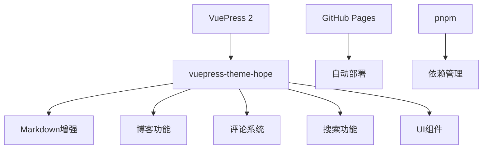
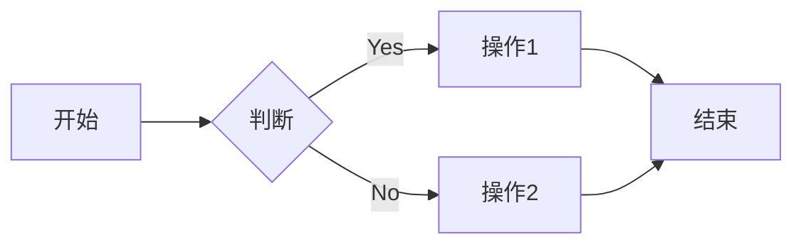

# SOV710博客开发指南

本文档提供了基于VuePress 2和vuepress-theme-hope的博客开发全面指南，包括环境配置、项目结构、主题配置、内容创建和部署等关键方面。

## 目录

- [1. 项目概述](#1-项目概述)
- [2. 开发环境搭建](#2-开发环境搭建)
- [3. 项目结构](#3-项目结构)
- [4. 配置文件详解](#4-配置文件详解)
- [5. 主题定制](#5-主题定制)
- [6. 内容创建](#6-内容创建)
- [7. 部署流程](#7-部署流程)
- [8. 功能扩展](#8-功能扩展)
- [9. 性能优化](#9-性能优化)
- [10. 图片资源处理](#10-图片资源处理)
- [11. 项目精简](#11-项目精简)
- [12. 常见问题解答](#12-常见问题解答)

## 1. 项目概述

SOV710博客是基于VuePress 2和vuepress-theme-hope主题的个人技术博客。项目具有以下主要特点：

- 使用Markdown撰写总结文章
- 支持文章分类、标签和专栏
- 内置评论系统(Giscus)和搜索功能
- 自动化部署至GitHub Pages
- 支持深色模式和响应式设计

### 技术栈



## 2. 开发环境搭建

### 安装依赖

确保已安装Node.js (推荐v18+)和pnpm。

```bash
# 检查Node.js版本
node -v

# 安装pnpm (如果尚未安装)
npm install -g pnpm

# 安装项目依赖
pnpm install

# 安装搜索插件
pnpm add -D @vuepress/plugin-search@next

# 安装代码高亮插件
pnpm add -D @vuepress/plugin-prismjs@next
```

### 启动开发服务器

```bash
# 启动开发服务
pnpm docs:dev

# 使用清除缓存模式启动
pnpm docs:clean-dev
```

### 构建项目

```bash
# 构建生产版本
pnpm docs:build
```

## 3. 项目结构

```
vuepress/
├── docs/                    # 文档源文件
│   ├── .vuepress/          # VuePress配置目录
│   │   ├── .cache/         # 缓存目录(自动生成)
│   │   ├── .temp/          # 临时文件(自动生成)
│   │   ├── public/         # 静态资源文件
│   │   │   ├── favicon.ico # 网站图标
│   │   │   ├── logo.jpg    # 博客Logo
│   │   │   └── avatar.jpg  # 用户头像
│   │   ├── styles/         # 样式定制文件
│   │   │   └── index.scss  # 自定义样式
│   │   ├── client.js       # 客户端配置
│   │   ├── config.js       # 主配置文件
│   │   └── theme.ts        # 主题配置文件
│   ├── posts/              # 博客总结目录
│   │   └── article*.md     # 总结文件
│   ├── columns/            # 专栏目录
│   │   └── columns1/       # Intel手册中文翻译
│   ├── README.md           # 首页
│   ├── about.md            # 关于页面
│   └── get-started.md      # 快速开始页面
├── manual/                 # 手册文档
│   ├── giscus_docs.md      # Giscus配置指南
│   └── requirement.md      # 项目需求文档
└── package.json            # 项目依赖和脚本
```

## 4. 配置文件详解

### config.js

VuePress的主配置文件，位于`.vuepress/config.js`：

```js
import { defineUserConfig } from 'vuepress'
import { viteBundler } from '@vuepress/bundler-vite'
import theme from "./theme.js";

export default defineUserConfig({
  lang: 'zh-CN',                          // 站点语言
  title: 'SOV710 Blog',                   // 站点标题
  description: 'Let\'s play arch & robotics!', // 站点描述
  
  theme,                                  // 使用配置的主题
  
  // Use Vite as bundler
  bundler: viteBundler(),
  
  // Markdown configuration
  markdown: {
    highlighter: {
      // Use PrismJS through theme's integration
      type: "prismjs",
      preloadLanguages: ['markdown', 'javascript', 'typescript', 'bash', 'css'],
    },
  },
  
  head: [
    // Add favicon
    ['link', { rel: 'icon', href: '/favicon.ico' }],
  ],
});
```

### theme.ts

主题配置文件，位于`.vuepress/theme.ts`：

```js
import { hopeTheme } from "vuepress-theme-hope";

export default hopeTheme({
  // 基本配置
  hostname: "https://sov710.github.io",   // 部署的网站域名
  author: {
    name: "SOV710",                      // 作者名称
    url: "https://github.com/sov710",    // 作者链接
  },

  // 增强导航栏样式
  navbarLayout: {
    start: ["Brand"],                    // 左侧显示品牌
    center: ["Links"],                   // 中间显示链接
    end: ["Search", "Outlook", "Repo"],  // 右侧显示搜索和其他
  },
  
  // 添加导航栏logo
  logo: "/logo.jpg",                     // 亮色模式logo
  logoDark: "/logo.jpg",                 // 暗色模式logo
  
  // 导航栏配置
  navbar: [
    "/",                                  // 首页
    {
      text: "总结",                       // 导航项标题
      icon: "pen-to-square",             // 图标
      prefix: "/posts/",                 // 路径前缀
      children: [                        // 子导航项
        { text: "所有总结", icon: "book", link: "" },
      ],
    },
    // 其他导航项...
    {
      text: "专栏",
      icon: "book",
      prefix: "/columns/",
      children: [
        { text: "Intel手册中文翻译", icon: "book", link: "columns1/" },
      ],
    },
    {
      text: "关于我",                    // 关于我页面
      icon: "user",                      // 用户图标
      link: "/about.html",               // 链接到about.html
    },
  ],

  // 侧边栏配置
  sidebar: {
    "/posts/": [
      {
        text: "总结",
        icon: "book",
        prefix: "",
        children: "structure",           // 自动生成侧边栏
      },
    ],
    "/columns/columns1/": [
      {
        text: "Intel手册中文翻译",
        icon: "book",
        prefix: "",
        children: "structure",           // 自动生成侧边栏
      },
    ],
  },

  // 博客设置
  blog: {
    name: "SOV710's Blog",
    description: "Let's play arch & robotics!",
    intro: "/about.html",                // 博主信息页面
    medias: {
      GitHub: "https://github.com/sov710", // 社交媒体链接
    },
    articleInfo: ["Date", "Category", "Tag", "ReadingTime"], // 文章信息
  },

  // 插件配置
  plugins: {
    blog: true,                          // 启用博客功能
    copyCode: {},                        // 启用代码复制
    catalog: {},                         // 启用自动目录
    components: {
      components: ["Badge"]              // 启用Badge组件
    },

    // 搜索功能配置 
    search: {
      isSearchable: (page) => page.path !== "/", // 排除首页
      maxSuggestions: 10,                // 最大建议数
      hotKeys: [{ key: "s", ctrl: true }], // 快捷键Ctrl+S
      locales: {
        "/": {
          placeholder: "搜索文档",        // 搜索框占位符
        },
      },
    },
    
    // 图标配置
    icon: {
      assets: "fontawesome",             // 使用FontAwesome图标
    }
  },

  // UI增强功能
  pageInfo: ["Author", "Original", "Date", "Category", "Tag", "ReadingTime"],
  
  // 样式定制
  fullscreen: true,                      // 支持全屏
  pure: false,                           // 非纯净模式
  
  // 深色模式设置
  darkmode: "toggle",                    // 深色模式切换

  // 页脚配置
  displayFooter: true,                   // 显示页脚
  footer: "MIT Licensed | Copyright © 2024 SOV710", // 页脚内容
  
  // 博客文本本地化
  locales: {
    "/": {
      // 修改 "Posts" 为 "Summaries"
      blogLocales: {
        article: "总结",
        articleList: "所有总结",
        category: "分类",
        tag: "标签",
        timeline: "时间线",
        timelineTitle: "昨日不再！",
        all: "全部",
        intro: "个人介绍",
        star: "收藏",
        slides: "幻灯片",
        encrypt: "加密",
      },
    },
  },
});
```

### client.js

客户端配置文件，位于`.vuepress/client.js`：

```js
import { defineClientConfig } from 'vuepress/client'

export default defineClientConfig({
  // vuepress-theme-hope提供了所有必要的布局
  layouts: {},
})
```

## 5. 主题定制

### 自定义样式文件

在`.vuepress/styles/index.scss`中创建自定义样式，增强导航栏和其他UI元素：

```scss
/**
 * Custom styles for the blog
 */

/* Navbar styling */
.navbar {
  backdrop-filter: blur(5px);
  background-color: rgba(var(--bg-color), 0.8) !important;
  box-shadow: 0 2px 8px rgba(0, 0, 0, 0.1);
  transition: all 0.3s ease;

  .site-name {
    font-weight: 600;
    letter-spacing: 0.5px;
  }

  .nav-links {
    .nav-item > a {
      font-weight: 500;
      transition: all 0.2s ease;
      
      &:hover {
        color: var(--c-brand);
        background-color: rgba(var(--c-brand), 0.1);
        transform: translateY(-2px);
      }
    }
    
    .dropdown-wrapper .dropdown-title {
      font-weight: 500;
    }
    
    .dropdown-wrapper .nav-dropdown {
      border-radius: 8px;
      box-shadow: 0 6px 12px rgba(0, 0, 0, 0.15);
      padding: 0.6rem 0;
      
      .dropdown-item {
        transition: all 0.2s ease;
        
        &:hover {
          background-color: rgba(var(--c-brand), 0.1);
        }
        
        a {
          padding: 0.5rem 1.5rem;
          
          &.router-link-active {
            color: var(--c-brand);
            font-weight: 500;
          }
        }
      }
    }
  }
}

/* 搜索框样式美化 */
.search-box {
  margin-right: 0.5rem;
  
  input {
    border-radius: 4px;
    transition: all 0.3s ease;
    border: 1px solid transparent;
    background-color: rgba(127, 127, 127, 0.1);
    
    &:focus {
      border-color: var(--c-brand);
      box-shadow: 0 0 0 2px rgba(var(--c-brand), 0.1);
    }
  }
  
  .suggestions {
    border-radius: 6px;
    box-shadow: 0 6px 12px rgba(0, 0, 0, 0.15);
    
    .suggestion {
      padding: 0.6rem 0.8rem;
      
      a {
        font-weight: 500;
        
        .page-title {
          font-weight: 600;
        }
      }
      
      &.focused {
        background-color: rgba(var(--c-brand), 0.1);
      }
    }
  }
}

/* 项目卡片样式美化 */
.project-panel {
  .project {
    transition: all 0.3s ease;
    border-radius: 8px;
    overflow: hidden;
    box-shadow: 0 4px 8px rgba(0, 0, 0, 0.1);
    
    &:hover {
      transform: translateY(-5px);
      box-shadow: 0 8px 16px rgba(0, 0, 0, 0.1);
    }
    
    .icon {
      padding: 1.5rem;
      font-size: 1.8rem;
      background: linear-gradient(to right bottom, var(--c-brand), #6d4ea3);
      color: white;
    }
    
    .name {
      font-weight: 600;
      font-size: 1.1rem;
    }
    
    .desc {
      opacity: 0.8;
      font-size: 0.95rem;
    }
  }
}
```

### 颜色主题定制

要自定义主题颜色，可以在`.vuepress/styles/palette.scss`文件中设置：

```scss
// 颜色变量
$theme-color: #3eaf7c;
$text-color: #2c3e50;
$bg-color: #ffffff;
$bg-color-secondary: #f8f8f8;
$border-color: #eaecef;
```

### 响应式设计

vuepress-theme-hope已内置响应式设计，会自动适配不同屏幕尺寸的设备。

## 6. 内容创建

### 首页配置

首页配置位于`docs/README.md`，使用Frontmatter配置：

```markdown
---
home: true
layout: Blog
icon: home
title: SOV710 Blog
heroImage: /logo.jpg
heroText: SOV710 Blog
tagline: Let's play arch & robotics!
heroFullScreen: true
projects:
  - icon: fa-brands fa-github
    name: Github
    desc: 博主的github喵
    link: https://github.com/SOV710

  - icon: fa-brands fa-zhihu
    name: 知乎
    desc: 博主的知乎链接喵
    link: https://www.zhihu.com/people/sov710

  # 更多项目...

footer: MIT Licensed | Copyright © 2025 SOV710
---
```

> 注意：使用`layout: Blog`而不是`layout: BlogHome`，这是VuePress 2的推荐用法。

### 项目图标配置

在首页中，可以使用FontAwesome图标来美化项目展示：

| 图标类型 | 图标代码示例 | 说明 |
|---------|------------|------|
| 品牌图标 | `fa-brands fa-github` | 用于展示品牌，如GitHub、知乎等 |
| 实心图标 | `fa-solid fa-book-open` | 用于展示书籍、文章等内容 |
| 轮廓图标 | `fa-regular fa-user` | 用于展示用户、设置等 |

### 总结创建

总结文章位于`docs/posts/`目录下，使用Markdown格式：

```markdown
---
date: 2022-01-01
category:
  - Category A
tag:
  - tag A
  - tag B
---

# 总结标题

## 二级标题

正文内容...

### 三级标题

更多内容...
```

#### Frontmatter配置项

| 配置项     | 说明                     | 示例值                  |
|------------|--------------------------|-------------------------|
| title      | 文章标题                 | "VuePress入门"          |
| date       | 发布日期                 | 2022-01-01              |
| category   | 文章分类(单个或数组)     | "前端" 或 ["前端", "Vue"] |
| tag        | 文章标签(数组)           | ["VuePress", "博客"]    |
| sticky     | 是否置顶                 | true                   |
| star       | 是否加星                 | true                   |
| order      | 排序权重                 | 1                      |
| author     | 作者                     | "SOV710"               |
| description| 描述                     | "这篇文章介绍VuePress" |
| cover      | 封面图                   | "/images/cover.jpg"    |

### 专栏创建

专栏是一系列相关文章的集合，可以在`docs/columns/`目录下创建：

1. 创建专栏目录，如`docs/columns/columns1/`
2. 在专栏目录中添加文章，使用Frontmatter定义顺序
3. 在主题配置中定义专栏侧边栏

专栏文章示例：

```markdown
---
title: Intel手册中文翻译第一篇
order: 1
category:
  - Intel手册中文翻译
tag:
  - 入门
---

# Intel手册中文翻译第一篇

专栏内容...
```

## 7. 部署流程

### GitHub Pages部署

1. 创建GitHub仓库(例如`sov710.github.io`)
2. 配置GitHub Actions工作流

在项目根目录创建`.github/workflows/deploy.yml`：

```yaml
name: Deploy VuePress site to GitHub Pages

on:
  push:
    branches: [main]

jobs:
  build-and-deploy:
    runs-on: ubuntu-latest
    steps:
      - name: Checkout
        uses: actions/checkout@v3

      - name: Setup Node.js
        uses: actions/setup-node@v3
        with:
          node-version: 18
          cache: pnpm

      - name: Install pnpm
        run: npm i -g pnpm

      - name: Install dependencies
        run: pnpm install

      - name: Build VuePress site
        run: pnpm docs:build

      - name: Deploy to GitHub Pages
        uses: JamesIves/github-pages-deploy-action@v4
        with:
          folder: docs/.vuepress/dist
          branch: gh-pages
```

### 自定义域名配置

1. 在DNS提供商处添加CNAME记录指向`sov710.github.io`
2. 在`.vuepress/public`目录下创建`CNAME`文件，内容为自定义域名

## 8. 功能扩展

### 搜索功能配置

本项目同时使用了两种搜索方式，可以根据需要选择其中一种：

#### 方法1: 使用主题内置的搜索功能

在`theme.ts`中配置:

```js
plugins: {
  // 其他插件配置...
  search: {
    isSearchable: (page) => page.path !== "/",
    maxSuggestions: 10,
    hotKeys: [{ key: "s", ctrl: true }],
    locales: {
      '/': {
        placeholder: "搜索文档",
      },
    },
  },
  
  icon: {
    assets: "fontawesome",
  }
}
```

#### 方法2: 使用外部搜索插件

1. 安装搜索插件：
```bash
pnpm add -D @vuepress/plugin-search@next
```

2. 在`config.js`中配置插件：
```js
import { searchPlugin } from '@vuepress/plugin-search'

// 在plugins数组中添加
plugins: [
  searchPlugin({
    locales: {
      '/': {
        placeholder: '搜索博客...',
      },
    },
    maxSuggestions: 10,
    hotKeys: ['s', '/'],
    isSearchable: (page) => page.path !== '/',
    getExtraFields: () => [],
  }),
]
```

### 评论系统配置

本项目使用Giscus作为评论系统，基于GitHub Discussions。配置步骤：

1. 启用GitHub Discussions
2. 安装Giscus GitHub App
3. 获取配置参数
4. 配置vuepress-theme-hope主题

```js
plugins: {
  comment: {
    provider: "Giscus",
    repo: "sov710/sov710.github.io",
    repoId: "your-repo-id",
    category: "Announcements",
    categoryId: "your-category-id",
    mapping: "pathname",
    reactionsEnabled: true,
    inputPosition: "bottom",
  },
},
```

详细配置请参考[Giscus配置指南](./giscus_docs.md)。

### Markdown增强功能

VuePress和vuepress-theme-hope支持多种Markdown增强功能：

#### 1. 数学公式

使用KaTeX渲染数学公式：

```markdown
$$ E = mc^2 $$
```

渲染效果:
$$ E = mc^2 $$

#### 2. 流程图

使用Mermaid绘制流程图：

```markdown

```

#### 3. 任务列表

```markdown
- [x] 已完成任务
- [ ] 未完成任务
```

#### 4. 代码块

```markdown
```javascript
console.log('Hello World!');
```
```

> 注意：代码块中的语言标识必须完整拼写，例如使用`javascript`而不是简写的`js`，以避免渲染错误。

## 9. 性能优化

### 图片优化

1. 压缩图片大小
2. 使用WebP格式
3. 为图片设置合适的宽度和高度

```markdown

```

### 延迟加载

vuepress-theme-hope内置支持图片和评论区的延迟加载功能。

### 打包优化

使用Vite打包器可以获得更快的构建速度和更小的输出文件。

## 10. 图片资源处理

### 图片资源路径规则

在VuePress中，图片资源的引用需要遵循一定的规则，来确保在开发和生产环境中都能正确显示。

#### 静态资源目录

VuePress约定`.vuepress/public`目录为静态资源目录，此目录中的文件会被复制到生成的网站根目录下。

```
docs/.vuepress/public/
├── favicon.ico      # 网站图标
├── logo.jpg         # 博客Logo
└── avatar.jpg       # 用户头像
```

#### 图片资源引用规则

1. **配置文件中的图片引用**

   在`theme.ts`和`config.js`中引用图片资源时，应使用**根路径**，以`/`开头：

   ```js
   // 正确方式
   logo: "/logo.jpg",
   logoDark: "/logo.jpg",
   
   // 错误方式 - 会导致无法找到资源
   logo: "./public/logo.jpg",  // 错误路径
   logo: "logo.jpg",           // 相对路径可能无效
   ```

   同样，在`config.js`的`head`配置中：

   ```js
   head: [
     // 正确方式
     ['link', { rel: 'icon', href: '/favicon.ico' }],
     
     // 错误方式
     ['link', { rel: 'icon', href: './public/favicon.ico' }], // 错误路径
   ],
   ```

2. **Markdown文件中的图片引用**

   在Markdown文件中引用图片有两种方式：

   - **使用根路径**（推荐）：以`/`开头，直接引用`public`目录下的资源
     ```markdown
     
     ```

   - **使用相对路径**：相对于当前Markdown文件的位置
     ```markdown
     
     ```
     注意：这种情况下，相对路径的图片应该放在与Markdown文件相同目录下的`images`文件夹中。

3. **组件中的图片引用**

   在Vue组件中引用图片时，可以使用：
   
   ```vue
   
   ```

### 图片资源最佳实践

1. **使用一致的路径规则**
   - 静态资源总是放在`.vuepress/public`目录下
   - 配置文件中使用根路径`/`引用
   - Markdown中可使用根路径`/`或相对路径`./`

2. **图片命名规范**
   - 使用有意义的文件名
   - 避免使用空格和特殊字符
   - 使用小写字母和连字符（如`hero-image.jpg`）

3. **图片格式选择**
   - 照片和复杂图像：使用`.jpg`或`.webp`
   - 图标和简单图像：使用`.png`或`.svg`
   - 动画：使用`.gif`或`.webp`

4. **图片优化**
   - 压缩图片以减小文件大小
   - 为不同设备提供不同分辨率的图片
   - 考虑使用懒加载

### 当前项目图片资源

当前项目中使用的主要图片资源如下：

| 文件名 | 路径 | 用途 | 引用位置 |
|--------|------|------|----------|
| favicon.ico | /docs/.vuepress/public/favicon.ico | 网站图标 | config.js中的head配置 |
| logo.jpg | /docs/.vuepress/public/logo.jpg | 网站Logo | theme.ts的logo和logoDark配置，README.md的heroImage |
| avatar.jpg | /docs/.vuepress/public/avatar.jpg | 用户头像 | 可在about.md中使用 |

### 常见图片问题排查

1. **图片无法显示**
   - 检查文件路径是否正确
   - 确认图片文件是否存在于正确位置
   - 检查引用路径是否使用了正确的格式（`/`开头）

2. **图片在开发环境显示但生产环境不显示**
   - 检查路径是否使用了相对路径而非根路径
   - 确认构建过程中图片是否被正确复制

3. **图片显示但路径有警告**
   - 检查是否使用了不规范的路径格式
   - 使用开发者工具查看具体的路径解析问题

## 11. 项目精简

为保持项目结构清晰和维护简单，建议定期清理冗余和不必要的文件。

### 可删除的示例文件

以下文件是示例文件，在实际开发中可以删除：

```
docs/posts/
├── article1.md ~ article12.md  # 示例文章，可删除
├── archive1.md, archive2.md    # 示例归档文章，可删除
├── sticky.md, sticky2.md       # 示例置顶文章，可删除
```

保留有实际内容的文章，如：
```
docs/posts/
├── 2024-07-10-intro.md        # 保留的实际文章
├── 2024-07-15-markdown.md     # 保留的实际文章
```

### 代码精简原则

1. **移除未使用的组件和依赖**
   - 检查package.json中的依赖是否都在使用
   - 删除未使用的插件配置

2. **配置文件精简**
   - 移除重复的配置
   - 使用默认值而非显式配置每个选项

3. **主题定制精简**
   - 只定制需要改变的部分
   - 移除与默认设置相同的配置

4. **样式表精简**
   - 合并相似的CSS规则
   - 移除未使用的样式定义

5. **文档精简**
   - 确保文档与代码一致
   - 移除过时的文档内容

## 12. 常见问题解答

### Q: 如何更新主题和插件？

```bash
pnpm docs:update-package
```

### Q: 如何解决构建错误？

1. 清除缓存: `pnpm docs:clean-dev`
2. 检查依赖: `pnpm install`
3. 检查配置文件语法错误

### Q: 如何解决常见警告？

1. `layout: BlogHome in frontmatter is deprecated`
   - 将 `layout: BlogHome` 改为 `layout: Blog`

2. `You are setting "markdown.code" option in vuepress config file`
   - 不要直接在config.js中使用`markdown.lineNumbers`或`markdown.code`
   - 应该在theme.ts中的markdown配置中设置highlighter：
   ```js
   // theme.ts
   markdown: {
     highlighter: {
       type: "prismjs",
       preloadLanguages: ['markdown', 'javascript', 'typescript', 'bash', 'css'],
     },
   }
   ```

3. `You are setting "markdown.highlighter" option in vuepress config file`
   - 将highlighter配置从config.js移到theme.ts的markdown选项中

4. `Missing flow highlighter, skip highlighting`
   - 可以忽略或安装相应的语法高亮插件
   - 或者在prismjsPlugin配置中指定需要预加载的语言

5. `@vuepress/plugin-search is not installed!`
   - 运行 `pnpm add -D @vuepress/plugin-search@next` 安装插件
   - 在theme.ts中配置search插件
   
6. `Error [ERR_MODULE_NOT_FOUND]: Cannot find package '@vuepress/plugin-prismjs'`
   - 运行 `pnpm add -D @vuepress/plugin-prismjs@next` 安装插件

7. `Element is missing end tag` 错误
   - 检查Markdown代码块，确保使用完整的语言标识，例如使用 `javascript` 而不是 `js`
   - 确保代码块开始和结束标记正确（三个反引号）

### Q: 如何在开发环境调试评论系统？

评论系统通常需要在生产环境正常工作。可以临时在`theme.ts`中添加测试仓库进行调试。

### Q: 如何自定义404页面？

在`docs/.vuepress/public`目录下创建`404.html`文件。

---

本文档提供了SOV710博客的全面开发指南。随着项目发展，建议定期更新此文档以保持其有效性和准确性。
