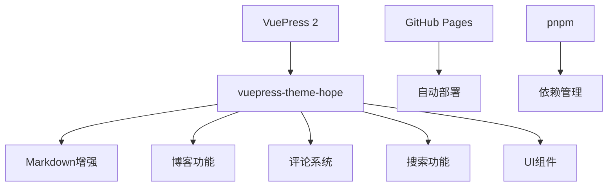
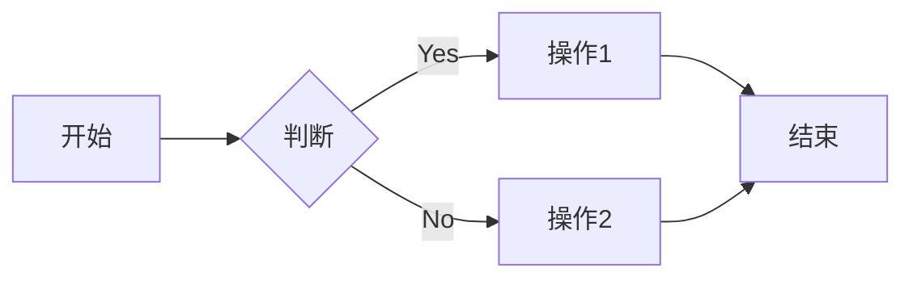

# SOV710博客开发指南

本文档提供了基于VuePress 2和vuepress-theme-hope的博客开发全面指南，包括环境配置、项目结构、主题配置、内容创建和部署等关键方面。

## 目录

- [1. 项目概述](#1-项目概述)
- [2. 开发环境搭建](#2-开发环境搭建)
- [3. 项目结构](#3-项目结构)
- [4. 配置文件详解](#4-配置文件详解)
- [5. 主题定制](#5-主题定制)
- [6. 内容创建](#6-内容创建)
- [7. 部署流程](#7-部署流程)
- [8. 功能扩展](#8-功能扩展)
- [9. 性能优化](#9-性能优化)
- [10. 常见问题解答](#10-常见问题解答)

## 1. 项目概述

SOV710博客是基于VuePress 2和vuepress-theme-hope主题的个人技术博客。项目具有以下主要特点：

- 使用Markdown撰写文章
- 支持文章分类、标签和专栏
- 内置评论系统(Giscus)和搜索功能
- 自动化部署至GitHub Pages
- 支持深色模式和响应式设计

### 技术栈



## 2. 开发环境搭建

### 安装依赖

确保已安装Node.js (推荐v18+)和pnpm。

```bash
# 检查Node.js版本
node -v

# 安装pnpm (如果尚未安装)
npm install -g pnpm

# 安装项目依赖
pnpm install
```

### 启动开发服务器

```bash
# 启动开发服务
pnpm docs:dev

# 使用清除缓存模式启动
pnpm docs:clean-dev
```

### 构建项目

```bash
# 构建生产版本
pnpm docs:build
```

## 3. 项目结构

```
vuepress/
├── docs/                    # 文档源文件
│   ├── .vuepress/          # VuePress配置目录
│   │   ├── .cache/         # 缓存目录(自动生成)
│   │   ├── .temp/          # 临时文件(自动生成)
│   │   ├── public/         # 静态资源文件
│   │   ├── client.js       # 客户端配置
│   │   ├── config.js       # 主配置文件
│   │   └── theme.ts        # 主题配置文件
│   ├── posts/              # 博客文章目录
│   │   └── article*.md     # 文章文件
│   ├── columns/            # 专栏目录
│   │   └── columns1/       # 专栏1
│   ├── README.md           # 首页
│   ├── about.md            # 关于页面
│   └── get-started.md      # 快速开始页面
├── manual/                 # 手册文档
│   ├── giscus_docs.md      # Giscus配置指南
│   └── requirement.md      # 项目需求文档
└── package.json            # 项目依赖和脚本
```

## 4. 配置文件详解

### config.js

VuePress的主配置文件，位于`.vuepress/config.js`：

```js
import { defineUserConfig } from 'vuepress'
import { viteBundler } from '@vuepress/bundler-vite'
import theme from "./theme.js";

export default defineUserConfig({
  lang: 'zh-CN',                          // 站点语言
  title: 'SOV710 Blog',                   // 站点标题
  description: '一个基于 VuePress 的技术博客', // 站点描述
  
  theme,                                  // 使用配置的主题
  
  markdown: {
    code: {
      lineNumbers: true,                  // 启用代码行号
    }
  },
  
  bundler: viteBundler(),                 // 使用Vite作为打包器
  
  head: [
    ['link', { rel: 'icon', href: '/favicon.ico' }], // 添加网站图标
  ],
});
```

### theme.ts

主题配置文件，位于`.vuepress/theme.ts`：

```js
import { hopeTheme } from "vuepress-theme-hope";

export default hopeTheme({
  // 基本配置
  hostname: "https://sov710.github.io",   // 部署的网站域名
  author: {
    name: "SOV710",                      // 作者名称
    url: "https://github.com/sov710",    // 作者链接
  },

  // 导航栏配置
  navbar: [
    "/",                                  // 首页
    {
      text: "文章",                       // 导航项标题
      icon: "pen-to-square",             // 图标
      prefix: "/posts/",                 // 路径前缀
      children: [                        // 子导航项
        { text: "所有文章", icon: "book", link: "" },
        { text: "示例文章", icon: "book", link: "article1" },
      ],
    },
    // 其他导航项...
    {
      text: "关于我",                    // 关于我页面
      icon: "user",                      // 用户图标
      link: "/about.html",               // 链接到about.html
    },
  ],

  // 侧边栏配置
  sidebar: {
    "/posts/": [
      {
        text: "文章",
        icon: "book",
        prefix: "",
        children: "structure",           // 自动生成侧边栏
      },
    ],
    // 其他侧边栏配置...
  },

  // 博客设置
  blog: {
    name: "SOV710's Blog",
    description: "一个基于VuePress的技术博客",
    intro: "/about.html",                // 博主信息页面
    medias: {
      GitHub: "https://github.com/sov710", // 社交媒体链接
    },
    articleInfo: ["Date", "Category", "Tag", "ReadingTime"], // 文章信息
  },

  // 插件配置
  plugins: {
    blog: true,                          // 启用博客功能
    copyCode: {},                        // 启用代码复制
    catalog: {},                         // 启用自动目录
    components: {
      components: ["Badge"]              // 启用Badge组件
    },
    
    // 搜索功能配置
    search: {
      provider: "local",                 // 使用本地搜索
      isSearchable: (page) => page.path !== "/", // 排除首页
      maxSuggestions: 10,                // 最大建议数
      hotKeys: [{ key: "s", ctrl: true }], // 快捷键Ctrl+S
      locales: {
        "/": {
          placeholder: "搜索文档",        // 搜索框占位符
        },
      },
    },
    
    // 图标配置
    icon: {
      assets: "fontawesome",             // 使用FontAwesome图标
    }
  },

  // 深色模式设置
  darkmode: "toggle",                    // 深色模式切换

  // 页脚配置
  displayFooter: true,                   // 显示页脚
  footer: "MIT Licensed | Copyright © 2024 SOV710", // 页脚内容
});
```

### client.js

客户端配置文件，位于`.vuepress/client.js`：

```js
import { defineClientConfig } from 'vuepress/client'

export default defineClientConfig({
  // vuepress-theme-hope提供了所有必要的布局
  layouts: {},
})
```

## 5. 主题定制

### 颜色主题定制

要自定义主题颜色，可以创建`.vuepress/styles/index.scss`文件：

```scss
// 自定义主题颜色
:root {
  // 品牌颜色
  --c-brand: #3eaf7c;
  --c-brand-light: #4abf8a;

  // 背景颜色
  --c-bg: #ffffff;
  --c-bg-light: #f3f4f5;
  --c-bg-lighter: #eeeeee;

  // 文本颜色
  --c-text: #2c3e50;
  --c-text-light: #3a5169;
  --c-text-lighter: #4e6e8e;
  --c-text-lightest: #6a8bad;
}

// 深色模式颜色
html.dark {
  --c-brand: #3aa675;
  --c-brand-light: #349469;

  --c-bg: #1e1e1e;
  --c-bg-light: #252525;
  --c-bg-lighter: #313131;

  --c-text: #f0f0f0;
  --c-text-light: #d8d8d8;
  --c-text-lighter: #bbbbbb;
  --c-text-lightest: #999999;
}
```

### 自定义布局

如需自定义主题布局，可以在`.vuepress/theme/layouts`目录下创建自定义布局组件。

### 响应式设计

vuepress-theme-hope已内置响应式设计，会自动适配不同屏幕尺寸的设备。

## 6. 内容创建

### 首页配置

首页配置位于`docs/README.md`，使用Frontmatter配置：

```markdown
---
home: true
layout: Blog
icon: home
title: SOV710 Blog
heroImage: /logo.png
heroText: SOV710 Blog
tagline: Let's play arch & robotics!
heroFullScreen: true
projects:
  - icon: fa-brands fa-github
    name: Github
    desc: 博主的github喵
    link: https://github.com/SOV710

  - icon: fa-brands fa-zhihu
    name: 知乎
    desc: 博主的知乎链接喵
    link: https://www.zhihu.com/people/sov710

  # 更多项目...

footer: MIT Licensed | Copyright © 2025 SOV710
---
```

> 注意：使用`layout: Blog`而不是`layout: BlogHome`，这是VuePress 2的推荐用法。

### 项目图标配置

在首页中，可以使用FontAwesome图标来美化项目展示：

| 图标类型 | 图标代码示例 | 说明 |
|---------|------------|------|
| 品牌图标 | `fa-brands fa-github` | 用于展示品牌，如GitHub、知乎等 |
| 实心图标 | `fa-solid fa-book-open` | 用于展示书籍、文章等内容 |
| 轮廓图标 | `fa-regular fa-user` | 用于展示用户、设置等 |

### 文章创建

文章位于`docs/posts/`目录下，使用Markdown格式：

```markdown
---
date: 2022-01-01
category:
  - Category A
tag:
  - tag A
  - tag B
---

# 文章标题

## 二级标题

正文内容...

### 三级标题

更多内容...
```

#### Frontmatter配置项

| 配置项     | 说明                     | 示例值                  |
|------------|--------------------------|-------------------------|
| title      | 文章标题                 | "VuePress入门"          |
| date       | 发布日期                 | 2022-01-01              |
| category   | 文章分类(单个或数组)     | "前端" 或 ["前端", "Vue"] |
| tag        | 文章标签(数组)           | ["VuePress", "博客"]    |
| sticky     | 是否置顶                 | true                   |
| star       | 是否加星                 | true                   |
| order      | 排序权重                 | 1                      |
| author     | 作者                     | "SOV710"               |
| description| 描述                     | "这篇文章介绍VuePress" |
| cover      | 封面图                   | "/images/cover.jpg"    |

### 专栏创建

专栏是一系列相关文章的集合，可以在`docs/columns/`目录下创建：

1. 创建专栏目录，如`docs/columns/columns1/`
2. 在专栏目录中添加文章，使用Frontmatter定义顺序
3. 在主题配置中定义专栏侧边栏

专栏文章示例：

```markdown
---
title: 专栏1第一篇
order: 1
category:
  - 专栏1
tag:
  - 入门
---

# 专栏1第一篇

专栏内容...
```

## 7. 部署流程

### GitHub Pages部署

1. 创建GitHub仓库(例如`sov710.github.io`)
2. 配置GitHub Actions工作流

在项目根目录创建`.github/workflows/deploy.yml`：

```yaml
name: Deploy VuePress site to GitHub Pages

on:
  push:
    branches: [main]

jobs:
  build-and-deploy:
    runs-on: ubuntu-latest
    steps:
      - name: Checkout
        uses: actions/checkout@v3

      - name: Setup Node.js
        uses: actions/setup-node@v3
        with:
          node-version: 18
          cache: pnpm

      - name: Install pnpm
        run: npm i -g pnpm

      - name: Install dependencies
        run: pnpm install

      - name: Build VuePress site
        run: pnpm docs:build

      - name: Deploy to GitHub Pages
        uses: JamesIves/github-pages-deploy-action@v4
        with:
          folder: docs/.vuepress/dist
          branch: gh-pages
```

### 自定义域名配置

1. 在DNS提供商处添加CNAME记录指向`sov710.github.io`
2. 在`.vuepress/public`目录下创建`CNAME`文件，内容为自定义域名

## 8. 功能扩展

### 搜索功能配置

本项目使用本地搜索功能，配置如下：

```js
plugins: {
  // 其他插件配置...
  search: {
    provider: "local",
    isSearchable: (page) => page.path !== "/",
    maxSuggestions: 10,
    hotKeys: [{ key: "s", ctrl: true }],
    locales: {
      '/': {
        placeholder: '搜索文档',
      },
    },
  },
}
```

使用方法：
- 点击导航栏中的搜索图标
- 使用快捷键 `Ctrl + S` 打开搜索
- 在搜索框中输入关键词进行搜索

### 评论系统配置

本项目使用Giscus作为评论系统，基于GitHub Discussions。配置步骤：

1. 启用GitHub Discussions
2. 安装Giscus GitHub App
3. 获取配置参数
4. 配置vuepress-theme-hope主题

```js
plugins: {
  comment: {
    provider: "Giscus",
    repo: "sov710/sov710.github.io",
    repoId: "你的repoId",
    category: "Announcements",
    categoryId: "你的categoryId",
    mapping: "pathname",
    reactionsEnabled: true,
    inputPosition: "bottom",
  },
},
```

详细配置请参考[Giscus配置指南](./giscus_docs.md)。

### Markdown增强功能

VuePress和vuepress-theme-hope支持多种Markdown增强功能：

#### 1. 数学公式

使用KaTeX渲染数学公式：

```markdown
$$ E = mc^2 $$
```

渲染效果:
$$ E = mc^2 $$

#### 2. 流程图

使用Mermaid绘制流程图：

````markdown

````

#### 3. 任务列表

```markdown
- [x] 已完成任务
- [ ] 未完成任务
```

#### 4. 代码块

````markdown
```js
console.log('Hello World!');
```
````

## 9. 性能优化

### 图片优化

1. 压缩图片大小
2. 使用WebP格式
3. 为图片设置合适的宽度和高度

```markdown

```

### 延迟加载

vuepress-theme-hope内置支持图片和评论区的延迟加载功能。

### 打包优化

使用Vite打包器可以获得更快的构建速度和更小的输出文件。

## 10. 常见问题解答

### Q: 如何更新主题和插件？

```bash
pnpm docs:update-package
```

### Q: 如何解决构建错误？

1. 清除缓存: `pnpm docs:clean-dev`
2. 检查依赖: `pnpm install`
3. 检查配置文件语法错误

### Q: 如何解决常见警告？

1. `layout: BlogHome in frontmatter is deprecated`
   - 将 `layout: BlogHome` 改为 `layout: Blog`

2. `You are setting "markdown.lineNumbers" option in vuepress config file`
   - 将 `markdown: { lineNumbers: true }` 改为 `markdown: { code: { lineNumbers: true } }`

3. `Missing flow highlighter, skip highlighting`
   - 可以忽略或安装相应的语法高亮插件

### Q: 如何在开发环境调试评论系统？

评论系统通常需要在生产环境正常工作。可以临时在`theme.ts`中添加测试仓库进行调试。

### Q: 如何自定义404页面？

在`docs/.vuepress/public`目录下创建`404.html`文件。

---

本文档提供了SOV710博客的全面开发指南。随着项目发展，建议定期更新此文档以保持其有效性和准确性。
