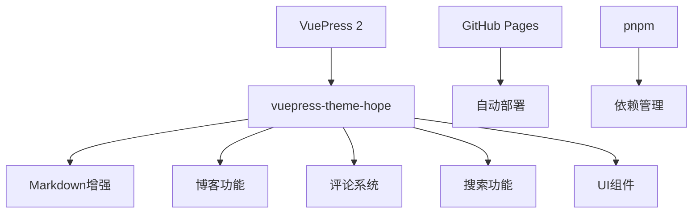

# 入门指南

本节提供了SOV710博客项目的快速入门指南，包括项目概述和开发环境搭建。

## 项目概述

SOV710博客是基于VuePress 2和vuepress-theme-hope主题的个人技术博客。项目具有以下主要特点：

- 使用Markdown撰写总结文章
- 支持文章分类、标签和专栏
- 内置评论系统(Giscus)和搜索功能
- 自动化部署至GitHub Pages
- 支持深色模式和响应式设计

### 技术栈



## 开发环境搭建

### 安装依赖

确保已安装Node.js (推荐v18+)和pnpm。

```bash
# 检查Node.js版本
node -v

# 安装pnpm (如果尚未安装)
npm install -g pnpm

# 安装项目依赖
pnpm install

# 安装搜索插件
pnpm add -D @vuepress/plugin-search@next

# 安装代码高亮插件
pnpm add -D @vuepress/plugin-prismjs@next
```

### 启动开发服务器

```bash
# 启动开发服务
pnpm docs:dev

# 使用清除缓存模式启动
pnpm docs:clean-dev
```

### 构建项目

```bash
# 构建生产版本
pnpm docs:build
```

## 内容目录

- [项目概述](./overview.md) - 了解SOV710博客的主要特性和功能
- [技术栈](./tech-stack.md) - 详细了解项目使用的技术栈和框架
- [项目结构](./project-structure.md) - 熟悉项目的文件和目录结构
- [开发环境搭建](./environment.md) - 如何设置开发环境
- [依赖安装](./dependencies.md) - 安装项目所需的依赖
- [开发服务器](./dev-server.md) - 启动和使用开发服务器

## 快速开始

如果你想快速启动项目，可以按照以下步骤操作：

1. 克隆仓库
2. 安装依赖：`pnpm install`
3. 启动开发服务器：`pnpm docs:dev`
4. 在浏览器中访问：`http://localhost:8080`

更详细的说明请参考各个子章节。

[返回文档首页](../index.md) 